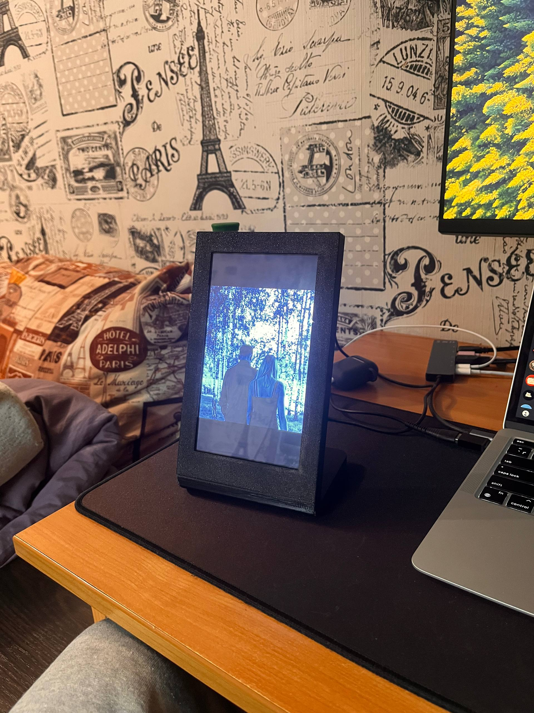
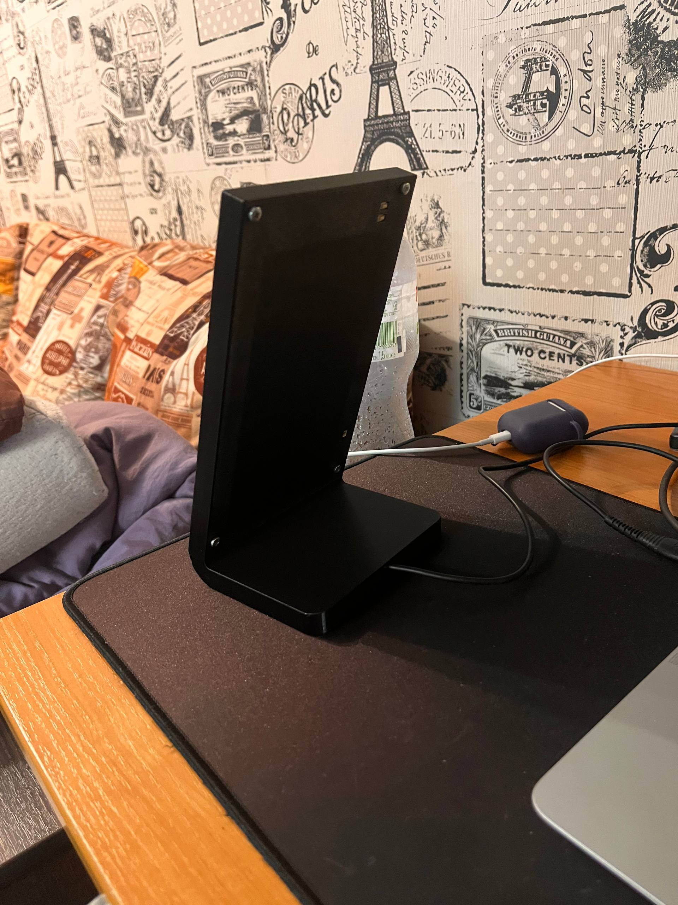

# ESP32 Portrait Photo Frame

A simple digital photo frame based on ESP32 with an 800×480 display, operating in portrait mode (480×800) with automatic slideshow.

## ✨ Key Features

- **Portrait Mode**: Display rotated 90° (480×800 pixels)
- **Automatic Slideshow**: Image change every 10 seconds
- **Image Centering**: All photos are always centered on the screen
- **Minimalist Interface**: No unnecessary elements, only images
- **SD Card Support**: Read JPEG files from a memory card

## 📋 Requirements

### Hardware
- ESP32-8048S070C board
- 800×480 display with RGB interface
- GT911 touchscreen (optional, not used in current version)
- SD card (FAT32 format)

### Software
- PlatformIO
- Arduino framework
- Libraries (specified in `platformio.ini`)

## ⚙️ Setup

1. **Prepare the SD Card**:
   - Format to FAT32
   - Use my converter: https://github.com/mcducx/converter-photo-esp32-8048S070C-photo-frame
   - Add JPEG files to the root directory
   - Optimal image size: 480×800 pixels

2. **Configure Parameters**:
   - Slideshow interval: modify `SLIDESHOW_INTERVAL` in `main.cpp`
   - Display orientation: `gfx.setRotation(1)` in `setup_display()`

## 🚀 Build and Upload

1. Clone the repository
2. Open the project in PlatformIO
3. Connect the ESP32 to your computer
4. Execute:
```bash
pio run --target upload
```
5. Insert the SD card with images
6. Reset the device

## 📁 Project Structure

```
src/
├── main.cpp          # Main slideshow logic
├── display.cpp       # Display driver and LVGL
├── display.h         # Display header file
└── config.h          # Pin configuration
platformio.ini        # PlatformIO configuration
```

## 🛠️ Used Libraries

- **LVGL** (v9.2.2): Graphics library
- **Arduino_GFX**: Display driver
- **TJpg_Decoder**: JPEG decoder
- **SD**: SD card support
- **TAMC_GT911**: Touchscreen driver

## 📄 License

MIT License

## 🙏 Acknowledgments

Project based on Arduino_GFX and LVGL libraries

# Resolving the Build Error

Add board to PlatformIO https://github.com/rzeldent/platformio-espressif32-sunton

When you first compile the project, you may encounter the following error:  
`.pio/libdeps/esp32-8048S070C/lvgl/src/lv_conf_internal.h:60:18: fatal error: ../../lv_conf.h: No such file or directory`

#### How to Fix

1. Navigate to the folder `.pio/libdeps/esp32-8048S070C/lvgl`.
2. Locate the file named `lv_conf_template.h`.
3. Copy this file to the parent directory: `.pio/libdeps/esp32s3box`.
4. Rename the copied file to `lv_conf.h`.

After completing these steps, you should have the file located at:  
`.pio/libdeps/esp32-8048S070C/lv_conf.h`

## Screenshot


